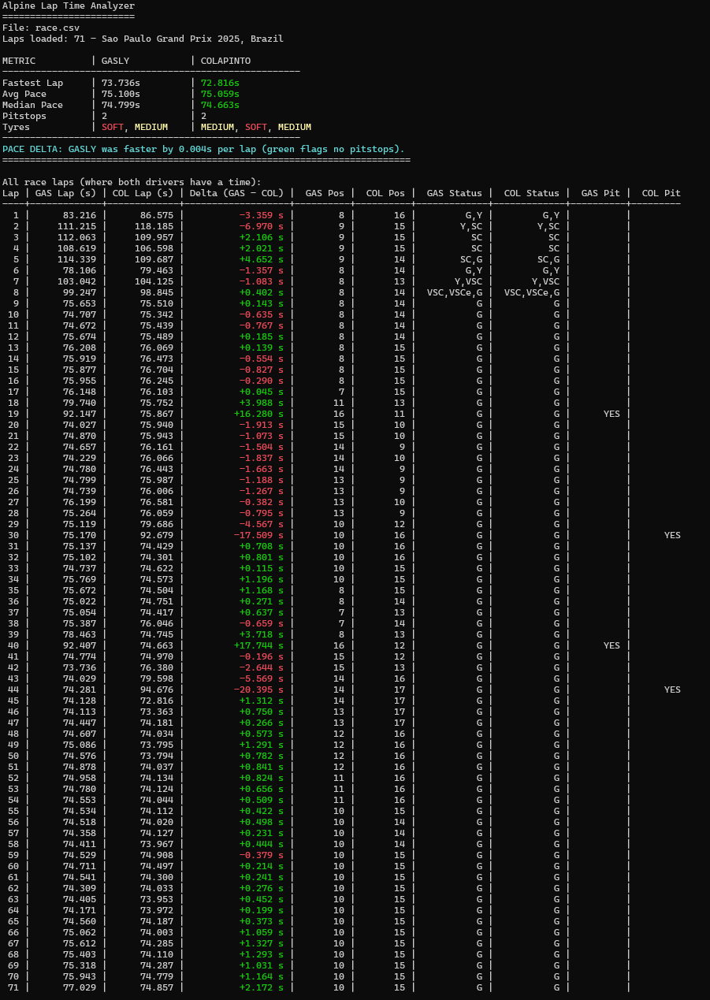

# Alpine Lap Time Analyzer



Small C# console app that analyzes Formula 1 lap time data for the **São Paulo Grand Prix 2025** and compares the two Alpine drivers:

- **Pierre Gasly**
- **Franco Colapinto**

It reads a telemetry CSV, calculates some basic pace stats, and prints a colour-coded lap-by-lap comparison table in the terminal.

---

## What it does

- Reads lap-by-lap timing data from a CSV file named **`race.csv`**.
- Filters out header / metadata rows automatically.
- For each driver, calculates:
  - Fastest lap
  - Average pace on **clean green-flag laps** (no pitstop on that lap)
  - Median pace on clean laps
  - Number of pitstops
  - Tyre compounds used, in stint order
- Computes an average **pace delta** between the two drivers on overlapping clean laps.
- Prints a detailed table for all laps where both drivers have a time, including:
  - Lap number
  - Lap times and delta (Gasly − Colapinto) with colour highlighting
  - Track position for each driver
  - Compact status codes and pitstop markers

Status codes in the table use short initials:

- `G` – Green  
- `Y` – Yellow  
- `SC` – Safety Car  
- `R` – Red flag  
- `VSC` – Virtual Safety Car  
- `VSCe` – Virtual Safety Car ending  

If multiple statuses are encoded in the telemetry for a single lap, they appear comma-separated, e.g. `VSC,VSCe,G`.

---

## How to run

**Install the .NET SDK**

   Make sure you have the .NET SDK installed and available on your PATH.  
   This project has been tested with **.NET 10.0**, but any recent .NET SDK that can run C# console apps should work.

   ```bash
   dotnet --version
   ```

**Run the analyzer**

   From the folder that contains your C# project file:

   ```bash
   dotnet run
   ```

   You should see:
   - A small summary table with fastest / average / median lap times and pitstops.
   - A tyre-usage line for each driver.
   - A pace-delta line showing who was quicker on average.
   - A full lap-by-lap table for the race.

---

## Data source / credits

The CSV telemetry used for this project was downloaded from:

**https://tracinginsights.com/**
